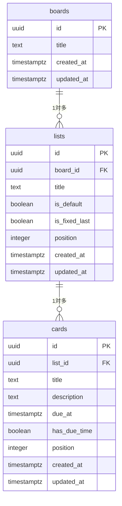

# データベース設計 v1.2

**関連文書**: [要件定義書](../requirements.md) ／ [機能仕様書](../functional-spec.md) ／ [API設計](api.md) ／ [運用手順](../operations.md) ／ [文書一覧](../README.md)

DB は **PostgreSQL 17**（Docker コンテナで実行。構成は リポジトリルートの `compose.yaml`）。アクセスは **Spring Data JPA / Hibernate** 経由とする（[要件定義書](../requirements.md) の「技術スタック」「セキュリティ」を参照）。

> **本文では「タスク」と書き、テーブル名は `cards` のままとする。** この対応は意図的なもの。理由は [要件定義書](../requirements.md) の「用語」を参照。

---

## 改訂履歴

| 版 | 日付 | 変更内容 |
| --- | --- | --- |
| 1.0 | 2026-08-13 | 要件定義書 v0.7 から分割して初版作成。内容の変更なし |
| **1.2** | **2026-08-16** | 要件定義書 v1.0（技術スタック確定）を反映。**ORM を Spring Data JPA / Hibernate、マイグレーションを Flyway に確定**し、5章を書き下ろした。**`position` の起点が 0 であることを明記**（画面モックは 1 始まりだが本書が正）。JPA 固有の注意点（`ddl-auto` を使わない、UUID のアプリ側採番、N+1）を設計メモに追記 |
| 1.1 | 2026-08-14 | 要件定義書 v0.8 を反映。**タスクの追加が末尾から先頭に変わったため、「position の採番方式」を改訂**（追加時にも再採番が必要になった）。あわせて本文の呼称を「タスク」に統一 |

---

## 1. ER図



`boards` は現状1件のみだが、テーブルとして独立させる。F-19（ボードの複数管理）が控えており、後からテーブルを分割するとデータ移行を伴うため。

`cards`（タスク）に `board_id` は**持たせない**。`lists` を辿れば特定できるため、重複して持つと更新漏れによる不整合の温床になる。

---

## 2. テーブル定義

**データ型は上の ER図を参照。** ここでは NULL 可否・既定値・制約のみを示す。

### 全テーブル共通の列

| 列 | NULL | 既定値 | 備考 |
| --- | --- | --- | --- |
| id | 不可 | — | PK。**アプリ側で UUID を採番する** |
| created_at | 不可 | `now()` | |
| updated_at | 不可 | `now()` | 更新時に現在時刻へ書き換える |

以下の各表では、これらの共通列を省略する。

### boards

| 列 | NULL | 既定値 | 備考 |
| --- | --- | --- | --- |
| title | 不可 | — | |

### lists

| 列 | NULL | 既定値 | 備考 |
| --- | --- | --- | --- |
| board_id | 不可 | — | FK → `boards.id`, `ON DELETE CASCADE` |
| title | 不可 | — | 空文字禁止（CHECK）。50文字以内 |
| is_default | 不可 | `false` | true なら削除・改名不可（TODO／進行中／完了） |
| is_fixed_last | 不可 | `false` | true なら常に最右に固定（完了のみ） |
| position | 不可 | — | **ボード内での左からの順序のみ**を表す |

### cards（タスク）

| 列 | NULL | 既定値 | 備考 |
| --- | --- | --- | --- |
| list_id | 不可 | — | FK → `lists.id`, `ON DELETE CASCADE`。**所属リストの唯一の情報源** |
| title | 不可 | — | 空文字禁止（CHECK）。100文字以内 |
| description | 不可 | `''` | 未入力は空文字。NULL と空文字を混在させない。5,000文字以内 |
| due_at | **可** | `NULL` | NULL は「期限なし」 |
| has_due_time | 不可 | `false` | 時分が指定されたか |
| position | 不可 | — | **リスト内での上からの順序のみ**を表す |

---

## 3. 設計メモ

- **`id` は UUID。** アプリ側で採番できるため、サーバー応答を待たずに画面へ反映する実装（楽観的更新）が可能になり、ドラッグ&ドロップの体感速度を上げられる
- **`due_at` は timestamptz。** 「期限」はローカル時刻の概念なので `timestamp` でも成立するが、実務での遭遇率を踏まえ timestamptz を採用する
- **`has_due_time` を分けている理由。** `due_at` は常に時分まで持つ（未入力なら 00:00）。これは色分け判定に必要なため。しかし「00:00 が未入力なのか、本当に0時指定なのか」は `due_at` だけでは区別できないので、フラグを分ける
- **`created_at` は MVP では画面に使わない**が、後から必要になったとき遡れないため最初から記録する
- **タスクの選択状態（一括削除用）はテーブルに持たない。** 画面上の一時状態であるため
- **`order` ではなく `position` を列名に使う。** `ORDER` は SQL の予約語であり、毎回クォートが必要になる
- **デフォルト3列の保護（`is_default`）はアプリケーション層で担保する。** 「デフォルト列の DELETE を禁止」を DB の制約で素直に表現できないため

### JPA / Hibernate 固有の注意点

- **UUID はアプリ側で採番する。** エンティティのコンストラクタで `UUID.randomUUID()` を代入し、`@GeneratedValue` も DB 側の `gen_random_uuid()` も使わない。上記の楽観的更新を成立させるには、**サーバーに問い合わせる前に id が決まっている**必要があるため
- **`spring.jpa.hibernate.ddl-auto` は `validate`（または `none`）にする。** `update` / `create` はスキーマの変更履歴を残さず、5章の方針と正面から衝突する。テーブルを作るのは Flyway の役目
- **`GET /api/board` は必ず `JOIN FETCH` か `@EntityGraph` を使う。** 素直に書くとリスト数ぶんの追加クエリが飛ぶ（N+1）。[API設計](api.md) が「一括取得で N+1 を避ける」としている箇所は、JPA では**黙っていると必ず踏む**ため、実装時に発行 SQL のログで確認する
- **一括再採番は `@Modifying` を付けた JPQL の UPDATE で行う。** 200件のエンティティを1件ずつ読み込んで書き戻すと、無駄な SELECT と UPDATE が並ぶ
- **発行 SQL のログは `logging.level.org.hibernate.SQL=DEBUG` で出す。** `spring.jpa.show-sql=true` は標準出力に垂れ流すだけでバインド値が見えないため使わない。バインド値は `logging.level.org.hibernate.orm.jdbc.bind=TRACE` で出す（[要件定義書](../requirements.md) の「発行SQLの可視化」）

---

## 4. position の採番方式

**採番は 0 から始まる単純連番（0, 1, 2, …）。並び替えの際は、対象となる親の中だけを一括で振り直す。**

> **起点は 0。** 画面モック（`mock/app.js`）は 1 始まりで実装されているが、**本書の 0 始まりが正**。モックを参照して実装する際は必ず読み替えること。

| 操作 | 更新範囲 |
| --- | --- |
| **タスクを先頭に追加**（F-06） | **対象リストのみ**再採番（最大200行）。新規タスクに `position = 0` を振り、既存タスクを +1 する |
| タスクを列内で移動／列間で移動 | **対象リストのみ**再採番（最大200行） |
| タスクの削除 | **対象リストのみ**再採番（最大200行）。空番を残さない |
| リストの追加・並び替え・削除 | **`lists` のみ**再採番（最大20行）。タスクは触らない |

> **追加が「再採番なし」から「再採番あり」に変わった。** 末尾追加だった当初は `max(position) + 1` を振るだけで済んだが、[機能仕様書](../functional-spec.md) の「タスクの追加位置」で先頭追加に変更したため、既存タスクの `position` をずらす必要が生じた。
>
> **性能上の問題はない。** 追加も移動と同じ「対象リストのみ一括再採番（最大200行）」に収まり、下の選定理由にあるとおり性能目標に対して2桁の余裕がある。**むしろ操作ごとに更新範囲が揃うため、実装は単純になる**（すべての並び順変更が「そのリストの並びを送り直す」という同一の形になる）。

`lists.position` / `cards.list_id` / `cards.position` はそれぞれ1つのことだけを表す。所属リストを `position` の数値に埋め込むような設計は採らない（`list_id` と情報が二重化し、外部キー制約が機能しなくなるため）。

**`(list_id, position)` に UNIQUE 制約は付けない。** 一括再採番の途中で必ず値が重複するため。付けるなら `DEFERRABLE INITIALLY DEFERRED` とする必要がある。**JPA を挟んでもこの事情は変わらない** — UPDATE を1文ずつ発行する以上、途中の状態で必ず重複する。

> **この判断の代償: `position` が重複しないことは、アプリケーション側だけが保証している。** DB は重複を弾かない。
>
> **もし重複した状態が commit されると、その並び順は不定になる。** `ORDER BY position` は同じ値どうしの順序を保証しないため、**リロードのたびにタスクの順番が入れ替わりうる。**
>
> 塞ぐなら `UNIQUE (list_id, position) DEFERRABLE INITIALLY DEFERRED` を付ければよい（検査が COMMIT 時まで遅れるため、再採番の途中の重複は許しつつ、commit された重複は防げる）。**2026-08-17 時点では付けない判断をしている**が、並び順が乱れる不具合が出た場合は真っ先にここを疑うこと。

> **`position` の値域に上限を設けてはならない。** [要件定義書](../requirements.md) の「データ量の想定上限」にある「1リストあたり200件」は**同時に存在する件数**の上限であり、`position` が取りうる値の上限ではない。`position <= 200` のような検証を入れると、削除で空番が積み上がった際に追加できなくなる。件数の判定は `COUNT(*)` で行う。

### 採番方式の選定理由

| 方式 | 評価 |
| --- | --- |
| **連番＋一括再採番（採用）** | 最も単純で破綻しない。1リスト最大200行の一括 UPDATE はローカルの PostgreSQL で数ミリ秒であり、性能目標（0.3秒以内）に対して2桁の余裕がある |
| 疎採番（一定間隔を空け、挿入時は中間値） | 更新行数は減るが、隙間が枯渇したときの再採番を別途実装する必要があり、実装量は増える。今回の規模では利点が出ない |
| 所属リストを position に埋め込む | `list_id` と情報が二重化し、外部キー制約と JOIN が機能しなくなる。またリスト操作のたびに全タスクの再採番が必要になり、かえって重い |

---

## 5. スキーマの管理

**マイグレーションツールは Flyway。** Spring Boot の起動時に自動で適用される。

- スキーマの変更は**必ずマイグレーションファイルとして記録し、バージョン管理下に置く**。DB に直接 `ALTER TABLE` を実行しない
- ボード1件とデフォルト3列（TODO／進行中／完了）は **seed** として投入する
- **`spring.jpa.hibernate.ddl-auto` は使わない**（`validate` に設定し、Flyway が作ったスキーマとエンティティの食い違いを起動時に検出させる）

### ファイル配置

```
backend/src/main/resources/db/migration/
  V1__create_tables.sql   -- boards / lists / cards の作成、制約、インデックス
  V2__seed_default_board.sql  -- ボード1件 ＋ デフォルト3列
```

- 命名は Flyway の規約どおり `V<番号>__<説明>.sql`（アンダースコア2つ）
- **一度適用したファイルは編集しない。** Flyway はチェックサムを記録しており、後から書き換えると起動時にエラーになる。変更は必ず新しい `V3__...` として追加する
- seed をマイグレーションに含めるのは、**空の DB から `gradlew bootRun` 一発で使える状態にするため**。ボードとデフォルト3列は仕様上必ず存在する前提（F-01）であり、任意の初期データではない

> **なぜ ORM 内蔵の機能ではなく独立したツールなのか。** Hibernate の `ddl-auto` はエンティティ定義から差分を推測してスキーマを変えるだけで、**何をいつ変えたかの記録が残らない**。空の DB から現在の構造を再現することも、巻き戻すこともできない。Flyway は変更を SQL ファイルとして残すため、DB の構造をコードと同じようにバージョン管理下に置ける。**DB を学ぶという副次目的の観点でも、実際に走る SQL が自分の書いた形で残る方が良い。**
