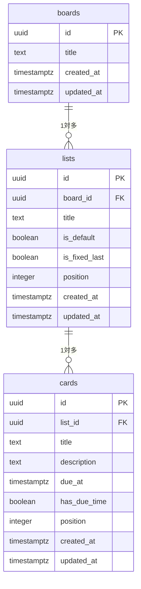

# タスク管理アプリ 要件定義書（内部版 v0.7）

ステータス: ドラフト（技術スタック未定）

> 本書は**内部版**であり、設計判断の理由や学習上の意図を含む。
> 対外提出用の資料は別途 `requirements-client.md` として作成する。

---

## 改訂履歴

| 版 | 日付 | 変更内容 |
| --- | --- | --- |
| 0.1 | 2026-08-12 | 初版作成 |
| 0.2 | 2026-08-12 | レビューによる仕様の詳細化。要確認事項を解消 |
| 0.3 | 2026-08-13 | データ保存方式を LocalStorage から **PostgreSQL に変更**。ログイン認証を追加。「前提条件とスコープ境界」「システム構成」「データベース設計」「API設計」「非機能要件」「将来の拡張」の章を新設。ER図・テーブル定義を追加 |
| 0.4 | 2026-08-13 | **ログイン認証を対象外に変更**（`users` テーブル、認証API、セキュリティ要件の該当項目を削除）。期限表示をゼロ埋めに統一。完了列の初期表示9件を `position` 順と明記 |
| 0.5 | 2026-08-13 | DBアクセス方式を **ORM に決定**。入力欄の文字数カウンタと上限到達時の挙動を新設。通信エラー時の挙動を新設。リスト名の文字数上限を追加 |
| 0.6 | 2026-08-13 | 3章の画面図を**ワイヤーフレーム相当に拡充**。詳細モーダル・エラー表示・カード拡大図・空状態を追加。期限の時分指定を「時刻を指定する」チェックボックス方式に決定。テーブル定義を簡素化（型は ER図 に一本化） |
| 0.7 | 2026-08-13 | **「利用シナリオ」の章を新設**（4章。以降の章番号を繰り下げ）。**完了列からの差し戻しを明示**し、完了列のカードにも移動ボタンを表示することを決定 |

### 版の刻み方

| 区分 | 対象 |
| --- | --- |
| 版を上げる | 機能の追加・削除、方針の変更、章の新設。**読み手が読み直す必要がある変更** |
| 版を上げない | 誤字修正、表現の調整、体裁の整理 |
| **1.0 とする条件** | 技術スタックが確定し、未決定事項がゼロになった時点。ここから実装に入る |

---

## 1. 目的と利用者

| 項目 | 内容 |
| --- | --- |
| 目的 | 自分の日々のタスクを Trello 風のボードで管理する |
| 副次目的 | Web 開発の学習（要件定義などの上流工程、DB設計、API設計） |
| 利用者 | 本人1名のみ |
| 利用端末 | PC のブラウザ |

---

## 2. 前提条件とスコープ境界

### 2.1 前提条件

以下を前提とする。前提が崩れた場合は要件の再検討が必要となる。

| # | 前提 | 崩れた場合の影響 |
| --- | --- | --- |
| P-1 | 利用者は1名のみ | 共有・権限管理の要件が発生する |
| P-2 | **外部公開せず、利用者のPC内でのみ動作する** | **認証が必須になる。** あわせてセキュリティ要件・可用性要件が全面的に発生する（15章参照） |
| P-3 | 利用端末はPCのブラウザのみ | スマートフォン対応が必要になる |
| P-4 | **利用開始時に、DBサーバーとバックエンドサーバーの起動操作を利用者が行える** | 起動を自動化する仕組みが必要になる |
| P-5 | データは利用者のPC内にのみ存在する | — |

> **P-4 は DB 採用に伴って新たに発生した制約。** LocalStorage 方式では「ブラウザで開くだけ」だったものが、利用のたびに起動操作を要するようになった。利用者にとっての手間が増えている点を前提条件として明示する。

### 2.2 対象に含むもの

- 単一ボードでのタスク管理（リスト・カードの作成／編集／削除、並び替え、期限管理）
- PostgreSQL によるデータの永続化
- バックエンド API の実装

### 2.3 対象に含まないもの

| 除外するもの | 理由 | 利用者への影響 |
| --- | --- | --- |
| **ログイン認証** | 利用者1名（P-1）かつ外部公開しない（P-2）ため、保護すべき対象がない。**ローカル環境では認証を設けてもDBへ直接接続すれば全データが参照できるため、アクセス制御としても機能しない** | アプリを開くと即座にボードが表示される |
| 共有・共同編集・権限管理 | 利用者1名（P-1） | 他者とタスクを共有できない |
| スマートフォン対応 | PCブラウザのみ（P-3） | **外出先でタスクを確認・更新できない** |
| 端末間のデータ同期 | **技術的には可能だが、意図的にスコープ外とする。** 実現するには P-2 の境界を越える必要がある | 別のPCからは利用できない |
| データのバックアップ機能 | MVP の範囲外（F-20） | **PC故障・DB破損時にデータを全て失う。** 必要な場合は付録Aの手順で利用者自身が退避する |
| Undo（元に戻す） | 削除前の確認ダイアログで代替する | 誤って確定した削除は復元できない |
| 優先度の設定 | カードのタイトルの付け方で代替できる | — |
| ソート機能（期限順・作成日順） | 手動の並び順と競合するため | 期限が近い順に自動で並べ替えることはできない |
| ファイル添付・メール通知 | 目的に対して不要 | — |

---

## 3. 用語と画面構造

```
ボード (Board)    … 一番外側の入れ物。1個のみ
 └ リスト (List)   … 縦の列
    └ カード (Card) … タスク1件
```

**画面はこのボード画面1つのみ。** 認証を対象外としたため、ログイン画面は存在しない。

以下はワイヤーフレーム相当の図であり、**要素の有無と配置を示すもの**。寸法・余白・書体・具体的な配色は含まない（16章のとおり未定）。

### 3.1 ボード画面（全体）

```
┌──────────────────────────────────────────────────────────────────────┐
│  マイタスク                                                           │
├──────────────┬──────────────┬──────────────┬────────────────────────┤
│ [←] TODO [→] │ [←] 進行中[→]│ [←] 設計 [→] │ 完了                   │
│              │              │   [改名][削除]│                        │
│              │              │              │ [☐ すべて選択]         │
│ ┏━━━━━━━━━━┓ │ ┌──────────┐ │              │ ☐┌───────────────────┐│
│ ┃ 請求書送付 ┃ │ │ 資料作成  │ │              │  │ 打合せ    08/01    ││
│ ┃ 08/10 09:00┃ │ │ 08/15    │ │ （カードなし）│  │ [↑][↓][←]   [削除] ││
│ ┃[↑][↓][←][→]┃ │ │[↑][↓][←][→]│              │  └───────────────────┘│
│ ┃       [削除]┃ │ │     [削除] │              │ ☐┌───────────────────┐│
│ ┗━━━━━━━━━━┛ │ └──────────┘ │              │  │ 見積提出           ││
│ ┏━━━━━━━━━━┓ │              │              │  │ [↑][↓][←]   [削除] ││
│ ┃ 買い物      ┃ │              │              │  └───────────────────┘│
│ ┃ 08/16      ┃ │              │              │      ：（9件目まで）   │
│ ┃[↑][↓][←][→]┃ │              │              │  ┌───────────────────┐│
│ ┃       [削除]┃ │              │              │  │ 10件目（上部のみ）  ││
│ ┗━━━━━━━━━━┛ │              │              │  ┈┈┈┈┈┈┈┈┈┈┈┈┈┈┈┈┈┈┈ │
│              │              │              │      [∨ もっと見る]    │
│ [+ カード追加]│ [+ カード追加]│ [+ カード追加]│ [+ カード追加]         │
│              │              │              │ [選択したものを削除]    │
└──────────────┴──────────────┴──────────────┴────────────────────────┘
                                        [+ リスト追加]
                                     （「完了」の左隣に挿入される）
```

| 要素 | 補足 |
| --- | --- |
| `[←] [→]`（列見出し） | 列の並び替え（F-05）。「完了」には表示しない |
| `[改名] [削除]` | **追加した列にのみ表示**。デフォルト3列には出さない（F-03, F-04） |
| `[↑][↓][←][→]`（カード） | カードの移動（F-12）。端では無効表示 |
| **完了列のカードの `[↑][↓][←]`** | **差し戻しのため、完了列のカードにも移動ボタンを表示する**（5.4）。「完了」は最右のため `[→]` は常に無効 |
| `☐` チェックボックス | **「完了」列のカードにのみ表示**（F-15） |
| `[☐ すべて選択]` | 「完了」列の見出し直下 |
| （カードなし） | **空状態。** カードが0件の列に表示する |
| `：` | 図の省略記号（実際の画面には表示しない） |
| 10件目 | 上部だけが覗く高さで切れる（F-14） |

### 3.2 カード（拡大）

```
 ┏━━━━━━━━━━━━━━━━━━━━┓  ← 期限による色付きボーダー（F-11）
 ┃ 請求書送付            ┃  ← タイトル
 ┃ 08/10 09:00           ┃  ← 期限（ゼロ埋め。未設定なら行ごと出さない）
 ┃ [↑][↓][←][→]   [削除] ┃  ← 操作ボタン
 ┗━━━━━━━━━━━━━━━━━━━━┛
```

一覧に表示するのは**タイトルと期限のみ**。説明文は表示しない（6.2）。

### 3.3 カードの詳細モーダル（F-07）

カードのタイトル部分をクリックすると開く。

```
      ┌────────────────────────────────────────────┐
      │ カードの詳細                          [ ✕ ] │
      ├────────────────────────────────────────────┤
      │ タイトル                                    │
      │ ┌────────────────────────────────────────┐ │
      │ │ 請求書送付                              │ │
      │ └────────────────────────────────────────┘ │
      │                                      5/100 │  ← 文字数カウンタ
      │                                            │
      │ 説明文                                      │
      │ ┌────────────────────────────────────────┐ │
      │ │ 8月分の請求書をまとめて送付する。        │ │
      │ │                                        │ │  ← 改行を保持
      │ │ ・A社                                   │ │
      │ │ ・B社                                   │ │
      │ │                                        │ │
      │ └────────────────────────────────────────┘ │
      │                                   348/5000 │
      │                                            │
      │ 期限                                        │
      │ ┌──────────────┐  ┌──────────┐            │
      │ │ 2026/08/10   │  │  09:00   │            │
      │ └──────────────┘  └──────────┘            │
      │ [ 期限をクリア ]   ☑ 時刻を指定する         │
      │                                            │
      ├────────────────────────────────────────────┤
      │                    [ キャンセル ] [ 保存 ] │
      └────────────────────────────────────────────┘
```

| 要素 | 補足 |
| --- | --- |
| 文字数カウンタ | 入力欄の右下。上限到達で赤（6.8） |
| `☑ 時刻を指定する` | **`cards.has_due_time` に対応。** 外すと時分の入力欄が無効になり、表示からも時分が消える |
| `[ 期限をクリア ]` | `due_at` を NULL に戻す（期限なし） |
| 閉じ方 | `[ ✕ ]`、`[ キャンセル ]`、背景クリックのいずれか（6.7） |

### 3.4 エラー時の表示（12.2）

#### 初期読み込みに失敗した場合

ボードを表示できないため、全面にエラーを出す。

```
┌───────────────────────────────────────────────────────────────────┐
│  マイタスク                                                        │
├───────────────────────────────────────────────────────────────────┤
│                                                                   │
│                              ⚠                                    │
│                                                                   │
│                 サーバーが起動していません。                        │
│              起動してから再読み込みしてください。                    │
│                                                                   │
│                        [ 再読み込み ]                              │
│                                                                   │
└───────────────────────────────────────────────────────────────────┘
```

#### 操作中に失敗した場合

ボードは表示されたまま、画面上部にメッセージを出す。**あわせて画面の表示を操作前の状態に戻す**（ロールバック）。

```
┌───────────────────────────────────────────────────────────────────┐
│ ⚠ データベースに接続できません。                            [ ✕ ] │
│   Docker が起動しているか確認してください。                        │
├───────────────────────────────────────────────────────────────────┤
│  マイタスク                                                        │
├──────────────┬──────────────┬──────────────┬─────────────────────┤
│ [←] TODO [→] │ [←] 進行中[→]│ [←] 設計 [→] │ 完了                │
│              （ボードはそのまま表示され、操作を続けられる）          │
└──────────────┴──────────────┴──────────────┴─────────────────────┘
```

---

## 4. 利用シナリオ

正式なユースケース記述（事前条件・代替フロー・例外フローを網羅する形式）ではなく、**機能をまたいだ操作の流れ**を示す。

**13章の機能一覧が「部品が揃っているか」を示すのに対し、本章は「その部品で目的を達成できるか」を確認するためのもの。** 機能単位で仕様を書いていると、機能と機能のつなぎ目が抜けやすい。

アクターは利用者本人1名のみ（P-1）。

### 4.1 UC-01 利用を開始する

**事前条件**: PC が起動している

| # | 操作 | 結果 |
| --- | --- | --- |
| 1 | Docker を起動し、PostgreSQL のコンテナを立ち上げる | DB が接続可能になる |
| 2 | バックエンドサーバーを起動する | API が応答可能になる |
| 3 | ブラウザで `localhost:3000` を開く | `GET /api/board` が実行される |
| 4 | — | ボード画面が表示される（F-01） |

**事後条件**: ボードが操作可能な状態になる

**代替フロー**

| 分岐 | 挙動 |
| --- | --- |
| 2 を実行していない | 全面エラー「サーバーが起動していません」＋再読み込みボタン（E-03） |
| 1 を実行していない | 全面エラー「データベースに接続できません」（E-04） |

> **この手順は P-4 そのもの。** 利用のたびに毎回必要になるため、**README に起動手順を記載する**こと。手順が文書化されていないと、しばらく使わなかった後に起動方法が分からなくなる。

### 4.2 UC-02 タスクを登録し、完了させる

最も基本的な流れ。

| # | 操作 | 結果 | 関連 |
| --- | --- | --- | --- |
| 1 | TODO 列の `[+ カード追加]` にタイトルを入力 | 列の末尾にカードが追加される | F-06 |
| 2 | カードをクリック | 詳細モーダルが開く | F-07 |
| 3 | 説明文と期限を入力し、`[ 保存 ]` | 内容が保存され、一覧にタイトルと期限が表示される | F-07, F-09 |
| 4 | — | 期限までの残り日数に応じてカードの色が変わる | F-11 |
| 5 | 着手時、カードの `[→]` を押す | 「進行中」列の末尾へ移動する | F-12 |
| 6 | 完了時、さらに `[→]` を押す | 「完了」列の末尾へ移動し、**色分けが薄いグレーに統一される** | F-12, 6.6 |

**事後条件**: カードが「完了」列に入り、期限による警告色が消える

### 4.3 UC-03 完了したタスクを差し戻す

誤って完了にした場合、または作業をやり直す場合。

| # | 操作 | 結果 |
| --- | --- | --- |
| 1 | 「完了」列の対象カードの `[←]` を押す | 「完了」の左隣の列へ移動する |
| 2 | — | 期限による色分けが復活する（6.6 の上書きが解除される） |

**この操作を可能にするため、「完了」列のカードにも移動ボタン `[↑][↓][←]` を表示する。** 「完了」は最右に固定されているため、`[→]` は常に無効となる。

> 完了列のカードには一括削除用のチェックボックスも表示されるため、**チェックボックスと移動ボタンが同居する**。他の列にはチェックボックスがない（5.4）。

### 4.4 UC-04 完了列を整理する

完了したタスクは削除しない限り蓄積し続けるため、定期的な整理を前提とする。

| # | 操作 | 結果 |
| --- | --- | --- |
| 1 | 完了列が10件を超える | 9件まで表示され、10件目が上部だけ覗く状態になる（F-14） |
| 2 | `[∨ もっと見る]` を押す | 全件が表示される |
| 3 | 削除したいカードのチェックボックスを入れる | 選択状態になる（**DBには保存されない**） |
| 4 | `[選択したものを削除]` を押す | 確認ダイアログが表示される |
| 5 | 確認する | 選択したカードがまとめて削除される（F-15） |

**全件を削除したい場合**は `[☐ すべて選択]` を使う。専用の「全件削除」ボタンは設けない。

### 4.5 UC-05 作業の流れに合わせて列を増やす

| # | 操作 | 結果 |
| --- | --- | --- |
| 1 | `[+ リスト追加]` に名前を入力 | **「完了」の左隣**に列が追加される（F-02） |
| 2 | 列見出しの `[←] [→]` を押す | 列の位置を調整する。「完了」より右へは移動できない（F-05） |
| 3 | 不要になったら `[削除]` を押す | 確認ダイアログの後、**中のカードごと削除される**（F-04） |

> 手順3で中のカードが消えることは、確認ダイアログの文言で明示する。カードを残したい場合は、事前に他の列へ移動しておく必要がある。

### 4.6 シナリオから確認できたこと

| 確認項目 | 結果 |
| --- | --- |
| 起動から利用開始までの流れ | **README への手順記載が必要**（本書のスコープ外だが、対応が必要） |
| 完了からの差し戻し | 完了列のカードにも移動ボタンが必要と判明。3.1 の図と 5.4 に反映済み |
| カードを残して列を削除する手段 | **専用機能はない。** 事前に手動で移動する運用でよいと判断 |
| 期限切れタスクの一覧表示 | **できない。** ソート・絞り込みは対象外（2.3、F-18） |

---

## 5. リスト（列）の仕様

### 5.1 デフォルトの3列

初回起動時（seed 投入時）、以下の3列が用意される。

| 列名 | 削除 | 名前変更 | 並び替え |
| --- | --- | --- | --- |
| TODO | 不可 | 不可 | 可 |
| 進行中 | 不可 | 不可 | 可 |
| **完了** | 不可 | 不可 | **不可（常に最右に固定）** |

削除・改名は、UI 上ボタン自体を表示しない。保護の根拠は `lists.is_default` フラグであり、**アプリケーション層で担保する**（DBの制約では表現しにくいため）。

### 5.2 ユーザーが追加した列

- 追加・名前変更・削除がすべて可能
- 削除時は確認ダイアログを出し、中のカードも一緒に削除される（DB上は `ON DELETE CASCADE`）
- **新規追加した列は「完了」の左隣に挿入される**

### 5.3 列の並び替え

タスクの流れは「完了より手前の工程が増える」ことが多いため、列の順番を後から変更できるようにする。

- 「完了」を除く全ての列を、左右に並び替えできる
- 「完了」より右へは移動できない（`lists.is_fixed_last` で表現する）

並び替えの操作は、カードと揃えて **「← →」ボタン**で行う。列のドラッグ&ドロップは MVP に含めず、F-21 として後から追加する。

### 5.4 「完了」列の特別扱い

| 項目 | 仕様 |
| --- | --- |
| 初期表示件数 | **9件**。`position` の昇順（＝画面上の並び順）で上から9件を表示する。作成日時順ではない |
| 10件目以降 | アコーディオンで折りたたむ。**10件目のカードが上部だけ覗いて見える**高さにし、続きがあることを視覚的に示す |
| 展開 | 「もっと見る」で全件表示、再度押すと9件に戻る |
| 選択削除 | 各カードにチェックボックス。「選択したものを削除」でまとめて削除（確認ダイアログあり） |
| 全選択 | 「すべて選択」のチェックボックスを用意し、これで全件削除を代替する |
| **カードの移動** | **他の列と同様に移動ボタンを表示する。** `[←]` で完了の左隣へ差し戻せる（UC-03）。「完了」は最右のため `[→]` は常に無効 |

チェックボックスは **「完了」列のカードにのみ**表示する（他の列には出さない）。したがって完了列のカードでは、**チェックボックスと移動ボタンが同居する**。

> **選択状態は DB に保存しない。** 画面上の一時的な状態であり、テーブルに持たせると再読み込み時の初期化責務が発生するため。

---

## 6. カード（タスク）の仕様

### 6.1 持たせる情報

| 項目 | 必須 | 内容 |
| --- | --- | --- |
| タイトル | 必須 | タスク名。空文字は不可 |
| 説明文（メモ） | 任意 | 詳細ポップアップで閲覧・編集。一覧には表示しない |
| 期限 | 任意 | 年月日は必須、時分は任意（6.3 参照） |
| 作成日時 | 自動 | 自動で記録 |

### 6.2 リスト内でのカードの表示

一覧に表示するのは **タイトル と 期限** の2つのみ。説明文は表示しない。

### 6.3 期限の入力ルール

- 期限を設定する場合、**年月日は必須**
- **時分は任意**。入力しなくてもよい
- 時分が入力されなかった場合、内部的には **00:00** として扱う
- 時分を指定するかどうかは、**「時刻を指定する」チェックボックス**で切り替える（3.3）。オフのときは時分の入力欄を無効にする。この状態が `cards.has_due_time = false` に対応する

> 入力欄の初期値を 00:00 にするだけでは、「未入力」と「0時を指定した」を利用者が区別できない。チェックボックスで明示的に切り替えることで、`has_due_time` の意味が画面上でも一貫する。

### 6.4 期限の表示ルール

**月・日・時・分はいずれも2桁でゼロ埋めする。** 桁数が揃うことで、カードが縦に並んだときに日付の位置が視覚的に揃う。

| 条件 | 表示 |
| --- | --- |
| 時分が未入力 | 時分を表示しない（例: `08/20`, `01/05`） |
| 時分が入力済み | 時分まで表示（例: `08/20 15:00`, `08/20 09:05`） |
| 期限の年が今年と異なる | 年を表示（例: `2027/01/05`） |
| 期限の年が今年と同じ | 年を表示しない（例: `08/20`） |
| 期限が未設定 | 何も表示しない |

年は4桁のまま表示する（ゼロ埋めの対象外）。

### 6.5 期限による色分け

色は **太めの色付きボーダーでカードを囲う**ことで表現する。

| 期限までの残り | ボーダー | 背景 | 文字色 |
| --- | --- | --- | --- |
| 期限超過 | 太い赤 | **赤** | **白** |
| 当日 | 太い赤 | **赤** | **白** |
| 翌日 | 太い赤 | 通常 | 通常 |
| 2〜3日以内 | 太い黄 | 通常 | 通常 |
| 4日以降 / 期限なし | 通常 | 通常 | 通常 |

背景が赤になるのは「当日および期限超過」のみ。その場合、コントラスト確保のため文字色を白にする。

> **具体的な色コードは実装時に決定する。** ただし 11.6 のコントラスト比要件（4.5:1 以上）を満たす必要があり、純粋な赤（`#FF0000`）に白文字では基準を満たさない。`#B3261E` 系の暗い赤を軸に、実装時にコントラスト比を実測して確定する。

**判定は「時刻」単位で行う。** 現在日時と期限日時を比較し、期限日時を過ぎていれば「期限超過」とする。時分が未入力のカードは 00:00 として扱われるため当日中は常に「期限超過」と判定されるが、表示は「当日」と同一のため見た目の差は出ない。

### 6.6 「完了」列での上書き

「完了」列にあるカードは、期限に関わらず以下の見た目に統一する（終わったタスクを警告する意味がないため）。

| ボーダー | 背景 | 文字色 |
| --- | --- | --- |
| 薄いグレー | 薄いグレー | 黒 |

**この上書きは「完了」列に在ることだけを条件とする。** したがって差し戻し（UC-03）で他の列へ移すと、期限による色分けが復活する。

### 6.7 カードの詳細表示

カードをクリックすると **ポップアップ（モーダル）** が開く。

- 説明文が長くても読みやすいよう、十分な幅と高さを確保する
- ポップアップ内でタイトル・説明文・期限を編集して保存できる
- 背景クリックまたは閉じるボタンで閉じる
- **説明文の改行は、入力どおりに表示へ反映される**（`white-space: pre-wrap` 相当）

> 改行を保持する実装で `innerHTML` を用いると XSS の入口になる。説明文は**必ずエスケープして表示する**（11.4 参照）。

### 6.8 入力欄の文字数制限

タイトル・説明文・リスト名の入力欄には、**現在の文字数と上限を常に表示する**。

| 項目 | 上限 | 表示例 |
| --- | --- | --- |
| カードのタイトル | 100 | `12/100` |
| カードの説明文 | 5,000 | `348/5000` |
| リスト名 | 50 | `4/50` |

- 表示位置は入力欄の**右下**
- **上限に達したら、それ以上入力できない**（入力を止める）
- 上限に達している間は、**文字数の表示を赤色にする**

> **赤色の文字も 11.6 のコントラスト比要件（4.5:1 以上）を満たすこと。** 背景が白の場合、`#FF0000` は基準を満たさないため、暗めの赤を使う。

#### 実装上の注意

| 注意点 | 内容 |
| --- | --- |
| 貼り付け | 上限を超える文字列を貼り付けた場合、**上限までで切り詰める**。貼り付け自体を拒否しない |
| 文字数の数え方 | **絵文字や一部の漢字は、プログラム上2文字として数えられる場合がある**（UTF-16 のサロゲートペア）。見た目の文字数と一致させるには、書記素単位で数える必要がある。MVP では単純な文字数カウントで可とし、この差異を許容する |
| サーバー側の検証 | **入力欄で止めていても、サーバー側で必ず再検証する**（11.4）。APIは直接呼び出せるため、画面側の制限は迂回できる |

---

## 7. カードの移動・並び替え

2つの操作方法を両方用意する。

| 方法 | 内容 |
| --- | --- |
| ドラッグ&ドロップ | 別の列へ、また列内の任意の位置へ移動する |
| ボタン操作 | 「↑ ↓ ← →」。↑↓は列内での上下移動、←→は隣の列への移動 |

ボタン操作を用意する理由は、ドラッグ&ドロップの実装が最も難しいため、先にボタン版で全体を完成させ、後からドラッグ&ドロップを足せるようにするため。

**移動ボタンは「完了」列を含むすべての列のカードに表示する。** 端の列では該当方向のボタンを無効にする（「完了」列では `[→]` が常に無効）。

**自動ソート機能は実装しない**（対象外）。並び順はすべて手動で決める。

---

## 8. システム構成

```
┌─ 利用者のPC ───────────────────────────────┐
│                                             │
│   ブラウザ (Chrome / Edge / Firefox)          │
│     │                                       │
│     │  HTTP  localhost:3000                 │
│     ▼                                       │
│   バックエンドサーバー                          │
│     ・API の提供                              │
│     ・入力値の検証                             │
│     ・業務ロジック（position の再採番など）        │
│     │                                       │
│     │  TCP  localhost:5432                  │
│     ▼                                       │
│   PostgreSQL サーバー（Docker 経由を想定）       │
│     │                                       │
│     ▼                                       │
│   データファイル（Docker ボリューム）             │
│                                             │
└─────────────────────────────────────────────┘
              ※ 外部からのアクセスは受け付けない（P-2）
```

**ブラウザから PostgreSQL へ直接接続することはできない。** ブラウザは生の TCP 接続を張れず、また DB の接続情報をブラウザ側のコードに置くことになるため。DB を採用したことで、両者の間にバックエンドサーバーが必須となった。

---

## 9. データベース設計

### 9.1 ER図



`boards` は現状1件のみだが、テーブルとして独立させる。F-19（ボードの複数管理）が控えており、後からテーブルを分割するとデータ移行を伴うため。

`cards` に `board_id` は**持たせない**。`lists` を辿れば特定できるため、重複して持つと更新漏れによる不整合の温床になる。

### 9.2 テーブル定義

**データ型は 9.1 の ER図を参照。** ここでは NULL 可否・既定値・制約のみを示す。

#### 全テーブル共通の列

| 列 | NULL | 既定値 | 備考 |
| --- | --- | --- | --- |
| id | 不可 | — | PK。**アプリ側で UUID を採番する** |
| created_at | 不可 | `now()` | |
| updated_at | 不可 | `now()` | 更新時に現在時刻へ書き換える |

以下の各表では、これらの共通列を省略する。

#### boards

| 列 | NULL | 既定値 | 備考 |
| --- | --- | --- | --- |
| title | 不可 | — | |

#### lists

| 列 | NULL | 既定値 | 備考 |
| --- | --- | --- | --- |
| board_id | 不可 | — | FK → `boards.id`, `ON DELETE CASCADE` |
| title | 不可 | — | 空文字禁止（CHECK）。50文字以内 |
| is_default | 不可 | `false` | true なら削除・改名不可（TODO／進行中／完了） |
| is_fixed_last | 不可 | `false` | true なら常に最右に固定（完了のみ） |
| position | 不可 | — | **ボード内での左からの順序のみ**を表す |

#### cards

| 列 | NULL | 既定値 | 備考 |
| --- | --- | --- | --- |
| list_id | 不可 | — | FK → `lists.id`, `ON DELETE CASCADE`。**所属リストの唯一の情報源** |
| title | 不可 | — | 空文字禁止（CHECK）。100文字以内 |
| description | 不可 | `''` | 未入力は空文字。NULL と空文字を混在させない。5,000文字以内 |
| due_at | **可** | `NULL` | NULL は「期限なし」 |
| has_due_time | 不可 | `false` | 時分が指定されたか |
| position | 不可 | — | **リスト内での上からの順序のみ**を表す |

### 9.3 設計メモ

- **`id` は UUID。** アプリ側で採番できるため、サーバー応答を待たずに画面へ反映する実装（楽観的更新）が可能になり、ドラッグ&ドロップの体感速度を上げられる
- **`due_at` は timestamptz。** 「期限」はローカル時刻の概念なので `timestamp` でも成立するが、実務での遭遇率を踏まえ timestamptz を採用する
- **`has_due_time` を分けている理由。** `due_at` は常に時分まで持つ（未入力なら 00:00）。これは色分け判定に必要なため。しかし「00:00 が未入力なのか、本当に0時指定なのか」は `due_at` だけでは区別できないので、フラグを分ける
- **`created_at` は MVP では画面に使わない**が、後から必要になったとき遡れないため最初から記録する
- **カードの選択状態（一括削除用）はテーブルに持たない。** 画面上の一時状態であるため
- **`order` ではなく `position` を列名に使う。** `ORDER` は SQL の予約語であり、毎回クォートが必要になる

### 9.4 position の採番方式

**採番は単純連番（0, 1, 2, …）。並び替えの際は、対象となる親の中だけを一括で振り直す。**

| 操作 | 更新範囲 |
| --- | --- |
| カードを末尾に追加 | **再採番なし。** そのリストの `max(position) + 1` を振る |
| カードを列内で移動／列間で移動 | **対象リストのみ**再採番（最大200行） |
| リストの追加・並び替え・削除 | **`lists` のみ**再採番（最大20行）。カードは触らない |

`lists.position` / `cards.list_id` / `cards.position` はそれぞれ1つのことだけを表す。所属リストを `position` の数値に埋め込むような設計は採らない（`list_id` と情報が二重化し、外部キー制約が機能しなくなるため）。

**`(list_id, position)` に UNIQUE 制約は付けない。** 一括再採番の途中で必ず値が重複するため。付けるなら `DEFERRABLE INITIALLY DEFERRED` とする必要がある。

> **`position` の値域に上限を設けてはならない。** 11.2 の「1リストあたり200件」は**同時に存在する件数**の上限であり、`position` が取りうる値の上限ではない。`position <= 200` のような検証を入れると、削除で空番が積み上がった際に追加できなくなる。件数の判定は `COUNT(*)` で行う。

### 9.5 スキーマの管理

- スキーマの変更は**必ずマイグレーションファイルとして記録し、バージョン管理下に置く**。DB に直接 `ALTER TABLE` を実行しない
- ボード1件とデフォルト3列（TODO／進行中／完了）は **seed スクリプト**で投入する
- マイグレーションツールは技術スタックに依存するため、確定後に決定する（16章）

---

## 10. API設計

バックエンドが提供するエンドポイントの一覧。詳細な入出力仕様は設計書側で定義する。

| メソッド | パス | 内容 |
| --- | --- | --- |
| GET | `/api/board` | ボード・リスト・カードを**一括取得**（初期表示用） |
| POST | `/api/lists` | リストの追加（完了の左隣に挿入） |
| PATCH | `/api/lists/:id` | リスト名の変更 |
| DELETE | `/api/lists/:id` | リストの削除（内部のカードも削除） |
| PATCH | `/api/lists/reorder` | リストの並び替え（再採番結果を一括送信） |
| POST | `/api/cards` | カードの追加（末尾） |
| PATCH | `/api/cards/:id` | カードの編集（タイトル・説明文・期限） |
| DELETE | `/api/cards/:id` | カードの削除 |
| PATCH | `/api/cards/move` | カードの移動（移動先リストと再採番結果を一括送信） |
| POST | `/api/cards/bulk-delete` | 完了列での選択削除 |

**再採番を伴う更新は1リクエスト・1トランザクションで完結させる。** 複数リクエストに分けると、途中で失敗した場合に並び順が壊れるため。

---

## 11. 非機能要件

### 11.1 性能

| 項目 | 目標値 |
| --- | --- |
| 初期表示（ボードが操作可能になるまで） | 2秒以内 |
| カードの追加・編集・削除の反映 | 1秒以内 |
| カードの移動（ボタン・ドラッグ&ドロップ） | **0.3秒以内** |

### 11.2 データ量の想定上限

| 項目 | 上限 |
| --- | --- |
| リスト（列）数 | 20 |
| 1リストあたりのカード数 | 200 |
| カード総数 | 2,000 |
| カードのタイトルの文字数 | 100 |
| カードの説明文の文字数 | 5,000 |
| リスト名の文字数 | 50 |

上限を超えた場合の動作は保証しない。

### 11.3 対応環境

| 項目 | 内容 |
| --- | --- |
| ブラウザ | **Google Chrome / Microsoft Edge / Mozilla Firefox** の最新版 |
| 動作確認の対象外 | Safari / Internet Explorer |
| 画面幅 | 1280px 以上 |
| OS | Windows 11 |
| 実行に必要なもの | PostgreSQL（Docker 経由を想定）、およびランタイム（技術スタック確定後に記載） |

### 11.4 セキュリティ

P-2（外部公開しない）かつ認証を持たないため、実装するのは以下に限定する。

| 項目 | 要件 |
| --- | --- |
| 入力値の検証 | **サーバー側で必ず行う。** ブラウザ側の検証は補助であり、迂回可能なため信頼しない |
| SQLインジェクション対策 | **ORM を使用し、文字列連結で SQL を組み立てない。** プレースホルダによる直接記述でも安全性は同等だが、ORM は危険な書き方が構造的にしにくいため採用する |
| 発行SQLの可視化 | **ORM が発行する SQL をログ出力する設定を有効にする。** 裏で何が実行されているか把握できないままだと、DB を学ぶという目的が損なわれるため |
| XSS対策 | **説明文・タイトルは HTML として解釈せず、必ずエスケープして表示する** |
| 機密情報の管理 | DB接続情報は環境変数で管理し、**リポジトリにコミットしない** |

**対象外**: 認証・セッション管理、HTTPS通信、CSRF対策、脆弱性の定期監査。いずれも P-2 を前提とした判断であり、**公開する場合は認証を含めて必須となる**（15章）。

### 11.5 データ保全

| 項目 | 内容 |
| --- | --- |
| バックアップ | **自動バックアップ機能は実装しない**（F-20）。付録Aに手動退避の手順を記載する |
| 想定されるデータ消失 | PC故障、DBの誤操作、**Docker ボリュームの削除** |
| 削除操作 | 確認ダイアログで防ぐ。Undo は実装しない |

### 11.6 ユーザビリティ・アクセシビリティ

| 項目 | 要件 |
| --- | --- |
| 文字色と背景色のコントラスト比 | **4.5:1 以上**（WCAG 2.1 レベルAA相当） |
| 操作可否の明示 | 移動できない方向のボタンは無効状態を視覚的に示す |
| 削除の取り消し | 実装しないため、確認ダイアログの文言で対象を明示する |
| 説明文の改行 | 入力どおりに表示へ反映する |

### 11.7 保守性

| 項目 | 要件 |
| --- | --- |
| スキーマ変更 | 必ずマイグレーションファイルとして記録し、バージョン管理下に置く |
| 初期データ | seed スクリプトで投入する |
| ログ | エラー発生時にサーバー側へ出力する |

---

## 12. 誤操作・エラーへの対策

### 12.1 誤操作

削除操作（カード削除・リスト削除・完了列の選択削除）の前に確認ダイアログを出す。
Undo（元に戻す）機能は実装しない。

### 12.2 通信エラー

DB とバックエンドを挟んだことで、**保存が失敗しうる状態**が新たに発生した。特に P-4（利用者自身がサーバーを起動する）を前提とするため、**起動を忘れたままブラウザを開く**ケースは日常的に起こる（UC-01）。

#### 失敗の種類による出し分け

| 状況 | 判別方法 | 表示するメッセージ |
| --- | --- | --- |
| バックエンドに接続できない | リクエスト自体が失敗する | **「サーバーが起動していません。起動してから再読み込みしてください」** |
| バックエンドは動作しているが DB に接続できない | サーバーが 5xx を返す | **「データベースに接続できません。Docker が起動しているか確認してください」** |
| 入力内容が検証で拒否された | サーバーが 4xx とメッセージを返す | 何が不正かを具体的に表示する |
| 想定外のエラー | 上記以外 | 「エラーが発生しました」＋ サーバー側のログに詳細を出力 |

#### 発生タイミングによる出し分け

| タイミング | 挙動 |
| --- | --- |
| **初期読み込み（`GET /api/board`）の失敗** | 画面に表示できる内容がないため、**全面にエラーメッセージと「再読み込み」ボタン**を表示する |
| **操作中（追加・編集・削除・移動）の失敗** | 画面は表示されているため、**画面上部にメッセージを表示**し、**楽観的更新をロールバックする** |

> **ロールバックは必須。** 画面へ先に反映してから保存する実装（楽観的更新）で失敗時に戻さないと、「画面上は移動したのに、リロードすると元に戻る」という食い違いが残る。利用者はどちらが本当のデータか判断できなくなる。

#### 対象外

自動リトライ機能は実装しない。利用者が原因（サーバー未起動など）を解消したうえで、手動で操作をやり直す。

---

## 13. 機能一覧と受け入れ条件

### 13.1 MVP

| ID | 機能 | 受け入れ条件 |
| --- | --- | --- |
| F-01 | 初期表示 | アプリを開くと TODO / 進行中 / 完了 の3列が表示される |
| F-02 | 列の追加 | 「+ リスト追加」で名前を入力すると、**「完了」の左隣**に列が増える |
| F-03 | 列の名前変更 | 追加した列は改名できる。デフォルト3列には改名ボタンが出ない |
| F-04 | 列の削除 | 追加した列は確認後に削除できる。中のカードも削除される。デフォルト3列には削除ボタンが出ない |
| F-05 | 列の並び替え | 「完了」以外の列を左右に動かせる。「完了」より右へは移動できず、完了自身も動かせない |
| F-06 | カードの追加 | 各列の「+ カード追加」でタイトルを入力すると末尾に追加される |
| F-07 | カードの詳細ポップアップ | カードをクリックするとポップアップが開き、タイトル・説明文・期限を編集して保存できる。**改行を含む説明文が、改行を保った状態で再表示される** |
| F-08 | カードの削除 | 確認ダイアログの後に削除される |
| F-09 | 期限の入力 | 年月日は必須、時分は任意で入力できる |
| F-10 | 期限の表示 | 月日時分はゼロ埋めで表示する。時分なしは時分を出さない。今年と異なる年のときだけ年を表示する |
| F-11 | 期限の色分け | 期限超過・当日は赤ボーダー＋赤背景＋白文字、翌日は赤ボーダー、2〜3日以内は黄ボーダーになる。完了列のカードは期限に関わらず薄いグレー＋黒文字になる |
| F-12 | ボタンでのカード移動 | ↑↓で列内、←→で隣の列へ移動する。端では該当ボタンが無効になる。**「完了」列のカードにも移動ボタンが表示され、`←` で差し戻せる。差し戻すと期限による色分けが復活する** |
| F-13 | カードのドラッグ&ドロップ | 別の列・列内の任意の位置へドラッグして移動できる |
| F-14 | 完了列の件数制限 | 完了列は `position` 順に9件まで表示し、10件目が上部だけ覗いて見える。「もっと見る」で全件展開できる |
| F-15 | 完了カードの選択削除 | チェックしたカードを確認後にまとめて削除できる。全選択も可能 |
| F-16 | データの永続化 | すべての変更が PostgreSQL に保存され、ブラウザ・サーバー再起動後も保持される |

#### 入力・エラー処理

| ID | 機能 | 受け入れ条件 |
| --- | --- | --- |
| E-01 | 文字数カウンタ | タイトル・説明文・リスト名の入力欄に `12/100` 形式で文字数が表示される。上限に達すると入力が止まり、文字数の表示が赤色になる |
| E-02 | 上限超過の貼り付け | 上限を超える文字列を貼り付けると、上限までで切り詰められる |
| E-03 | サーバー未起動時 | サーバーを起動せずにアプリを開くと、全面にエラーと「再読み込み」ボタンが表示される |
| E-04 | DB未起動時 | サーバーのみ起動し DB を起動していない状態で操作すると、Docker の起動を促すメッセージが表示される |
| E-05 | 操作中の通信失敗 | 移動・編集の途中で通信が失敗すると、画面上部にメッセージが出て、**画面の表示が操作前の状態に戻る** |

### 13.2 MVP 後に追加する

| ID | 機能 |
| --- | --- |
| F-17 | ラベル（色タグ） |
| F-18 | カードの検索・絞り込み |
| F-19 | ボードの複数管理 |
| F-20 | データのバックアップ（書き出し・読み込み） |
| F-21 | 列のドラッグ&ドロップ並び替え（F-05 のボタン操作を補完する） |

### 13.3 対象外

ログイン認証、共有・共同編集・権限管理、スマートフォン対応、端末間同期、ファイル添付、通知、Undo、優先度、自動ソート。

---

## 14. 開発の進め方

1ステップごとに必ずブラウザで動作を確認し、コミットする。まとめて作らない。

| Step | 内容 | 完了の目安 |
| --- | --- | --- |
| 0 | 開発環境のセットアップ | ブラウザに画面が表示される |
| 1 | **DB構築**（Docker、スキーマ、マイグレーション、seed） | `psql` で3列が確認できる |
| 2 | デフォルト3列の表示（F-01） | **DBから取得して表示する** |
| 3 | カードの追加（F-06, F-16） | リロードしても残る |
| 4 | カードの詳細ポップアップ・削除（F-07, F-08） | 説明文の改行保持もここで |
| 5 | 期限の入力・表示ルール（F-09, F-10） | ゼロ埋め、時分なし、年の出し分けまで |
| 6 | 期限の色分け（F-11） | コントラスト比を実測して色を確定する |
| 7 | 文字数カウンタと通信エラー表示（E-01〜E-05） | サーバーを止めて動作を確認する |
| 8 | ボタンでのカード移動（F-12） | **position の再採番はここで実装する。UC-02・UC-03 が通る。この時点で実用的に使える** |
| 9 | 列の追加・改名・削除・並び替え（F-02〜F-05） | 完了列の固定もここで。UC-05 が通る |
| 10 | 完了列の件数制限と選択削除（F-14, F-15） | アコーディオンの見せ方。UC-04 が通る |
| 11 | カードのドラッグ&ドロップ（F-13） | 最難関。ライブラリを使う。**ここで MVP 完成** |

> **旧版で独立していた「永続化」の Step は、Step 1〜3 に内包された。** DB を先に作る構成では、最初から永続化された状態で開発が進むため。
>
> Step 1 を先頭に置いているのは、DB とバックエンドが土台であり、後から差し込むと画面側の作り直しが発生するため。
>
> **Step 0〜1 の完了時点で、UC-01（利用開始の手順）を README に記載すること。**

---

## 15. 将来の拡張：公開する場合に決定すべき事項

MVP は P-2（外部公開しない）を前提とする。将来クラウドへ公開する場合、以下の検討が新たに必要となる。**検討漏れではなく、意図的にスコープ外としている。**

| 分類 | 決定すべきこと |
| --- | --- |
| **認証** | **公開する時点で必須になる。** `users` テーブルの追加、パスワードのソルト付きハッシュ保存、セッション管理、未認証時の制御。`boards` に `user_id` を追加してデータを分離する必要もある |
| 公開範囲 | 第三者の登録を許すか（招待制／登録無効化／ドメイン制限） |
| ホスティング | アプリとDBの配置先、無料枠の制限、月額上限、独自ドメイン、開発用と本番用のDB分離 |
| セキュリティ | HTTPS、Cookie属性（HttpOnly / Secure / SameSite）、CSRF対策、ログイン試行回数の制限、パスワードポリシー、依存パッケージの脆弱性対応 |
| 個人情報 | パスワードリセット（`users` へのメールアドレス列の追加と、メール送信基盤が必要）、退会とデータ削除、プライバシーポリシー |
| 可用性・運用 | バックアップと復旧手順（RPO / RTO）、監視と障害通知、想定稼働時間、ログの保存方針 |
| 前提の見直し | **P-3（PCのみ）が維持できなくなる。** 公開の目的が「どこからでも使う」ことである以上、スマートフォン対応が事実上要求される |
| 非機能要件 | レスポンス目標・同時接続数・データ量を、実測に基づく数値で置き直す |

---

## 16. 未決定事項

| 項目 | 状態 |
| --- | --- |
| **技術スタック（言語・フレームワーク）** | **未定。** 課題側で指定される可能性があるため、説明を待って決定する |
| 構成（フロントとバックエンドを一体にするか分離するか） | 未定。一体型（フルスタックフレームワーク）を推奨 |
| ORM の製品 | 未定。技術スタックに依存する（ORM を使うこと自体は決定済み。11.4） |
| マイグレーションツール | 未定。技術スタックに依存する。ORM に内蔵されている場合はそれを使う |
| 配色・余白・具体的な色コード | 未定。MVP は機能優先。ただし 11.6 のコントラスト比要件を満たすこと |

---

## 付録A. データのバックアップ手順

自動バックアップは実装しない（F-20）。データが失われて困る場合は、以下の手順で手動退避する。

### 退避

```bash
pg_dump -h localhost -U <ユーザー名> -d <DB名> -F c -f backup_YYYYMMDD.dump
```

### 復元

```bash
pg_restore -h localhost -U <ユーザー名> -d <DB名> --clean backup_YYYYMMDD.dump
```

### 注意

> **Docker のボリュームを削除すると、DB のデータは完全に失われる。**
> `docker compose down -v` の `-v` オプションはボリュームを削除する。コンテナだけを停止したい場合は `-v` を付けずに `docker compose down` を実行すること。
>
> 同様に `docker volume prune` も未使用ボリュームを削除するため、実行前に対象を確認すること。
